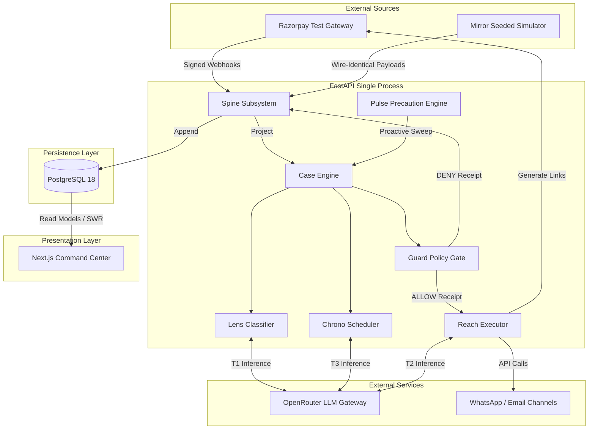
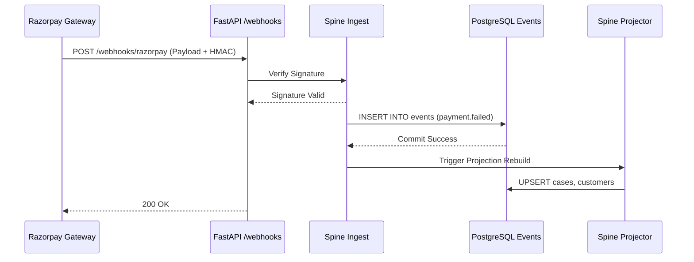
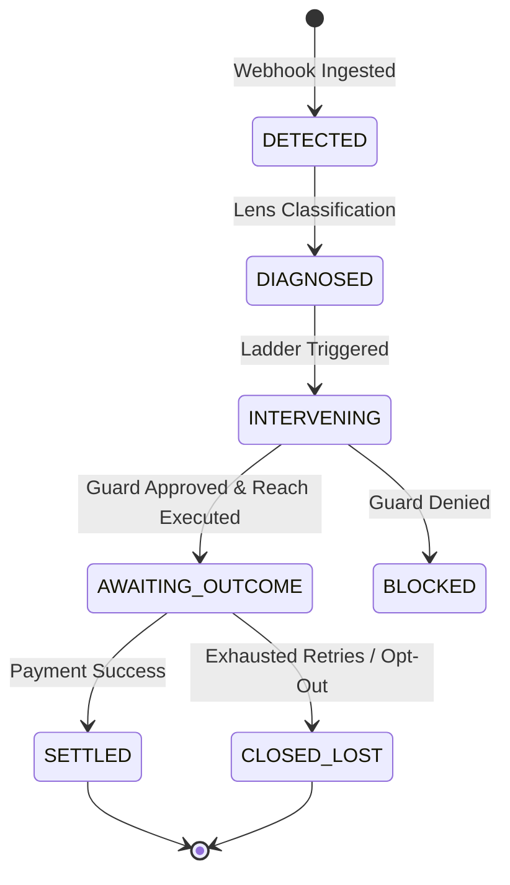
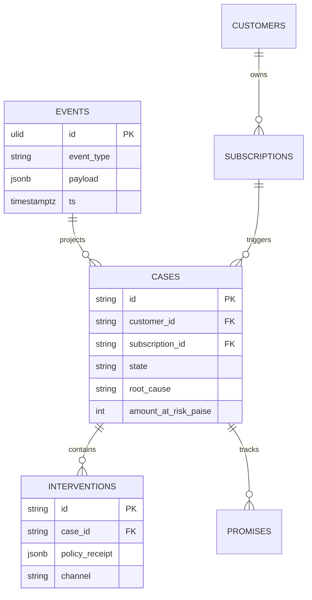

# SENTIO - System Architecture Document

## 1. Executive Summary

This document provides a comprehensive architectural blueprint for SENTIO, a policy-governed, autonomous revenue recovery layer built for the Razorpay AI Buildathon 2026. SENTIO is designed to sit directly between the payment gateway (Razorpay) and the end consumer. Its core mandate is to automatically detect failed subscription charges, diagnose the root cause of the failure using a blend of deterministic heuristics and neural inference, and execute highly regulated recovery interventions. 

The architecture is explicitly constructed to prioritize compliance, auditability, and mathematical reproducibility over raw generative capabilities. By enforcing a strict Event Sourcing paradigm and utilizing Command Query Responsibility Segregation (CQRS), SENTIO guarantees that every single action, decision, and financial calculation can be reconstructed from an immutable event log.

## 2. High-Level Architecture Topology

The SENTIO system is structured as a monolithic single-process FastAPI backend, backed by an asynchronous PostgreSQL database, and fronted by a Next.js App Router dashboard. This topology minimizes distributed system complexities (e.g., network partitions, distributed transactions) while maximizing throughput for the expected webhook volume.

## 3. Subsystem Deep Dives

### 3.1 The Spine (Event Sourcing & Ingestion)

The Spine is the central nervous system of SENTIO. It is responsible for accepting incoming stimuli from Razorpay, verifying their cryptographic authenticity, and persisting them into an append-only event store.

- **Cryptographic Verification:** All inbound requests are subjected to SHA-256 HMAC signature verification (`backend/app/spine/verify.py`). Requests failing this check are immediately dropped with a 401 Unauthorized response, preventing payload spoofing.
- **Append-Only Store:** The core persistence mechanism is the `events` table. This table operates under a strict append-only mandate. `UPDATE` and `DELETE` SQL operations are architecturally prohibited and restricted at the database user level.
- **Idempotency & Deduplication:** The Spine enforces exactly-once processing semantics. Duplicate Razorpay webhook IDs are caught via PostgreSQL `UNIQUE` constraints, preventing double-processing of network retries.
- **Deterministic Projections:** The `projector.py` module consumes the linear event stream to rebuild the current state of read models (`cases`, `customers`, `subscriptions`). If the read models are destroyed, they can be flawlessly reconstructed by replaying the event log from genesis.

### 3.2 The Case Engine (State Machine)

The Case Engine coordinates the lifecycle of a recovery effort. It strictly orchestrates state transitions and does not perform network operations or neural inference.

- **State Transitions:** Cases transition through a strict linear lifecycle: `DETECTED` -> `DIAGNOSED` -> `INTERVENING` -> `AWAITING_OUTCOME`.
- **Terminal States:** Cases conclude in either `SETTLED` (revenue recovered) or `CLOSED_LOST` (exhausted retries or customer opt-out).
- **Ladder Progression:** The engine selects specific recovery ladders based on the root cause diagnosed by the Lens subsystem.

### 3.3 The Lens Classifier (Root Cause Diagnosis)

The Lens subsystem is responsible for determining exactly why a transaction failed.
- **Deterministic Matrix:** Lens first evaluates the failure code against a hardcoded, highly optimized heuristic matrix covering known gateway errors (e.g., `BAD_REQUEST_ERROR`, `INSUFFICIENT_FUNDS`). This matrix resolves ~90% of failures in under 5 milliseconds.
- **LLM Fallback (T1):** For undocumented, opaque, or anomalous decline strings (the "long tail"), Lens invokes the T1 Touchpoint via OpenRouter. T1 performs semantic analysis to categorize the failure.
- **Confidence Thresholding:** Any T1 inference yielding a confidence score below 0.7 triggers a deterministic human-handoff protocol. The system is barred from improvising recovery strategies on low-confidence data.

### 3.4 The Chrono Scheduler (Temporal Logic)

Chrono governs the temporal dimensions of the recovery process, ensuring compliance with legal and operational time constraints.
- **Legal Windows:** Chrono enforces daylight outreach rules (e.g., strictly between 09:00 and 21:00 IST). Interventions proposed during quiet hours are intercepted and rescheduled for the next legal window (e.g., 09:15 AM IST the following day).
- **Payday Proximity:** The subsystem calculates the temporal distance to the customer's next estimated payday, utilizing this vector to optimize the timing of payment link dispatches.
- **PTP Extraction:** Chrono integrates with the T3 Touchpoint to parse unstructured customer replies (Promise-To-Pay) into structured ISO-8601 dates, booking asynchronous wake-up jobs in the database queue.

### 3.5 The Guard Policy Engine (Compliance Firewall)

The Guard is a non-negotiable compliance firewall. Every outbound action proposed by the Case Engine must be cryptographically signed off by the Guard.
- **Deterministic Gates:** Guard evaluates proposals against 8 immutable rules, including a master kill switch, opt-out registers, retry budget ceilings, and contact frequency caps (maximum 3 contacts per 7 days, minimum 6 hours between contacts).
- **Cryptographic Receipts:** For every evaluation, Guard generates an immutable JSON receipt detailing the exact rules evaluated and their binary outcomes. This receipt is persisted in the Spine, providing a flawless audit trail for regulators.

### 3.6 The Reach Executor (Side Effects)

Reach is the singular subsystem architecturally permitted to perform external side effects and network mutations.
- **Payment Link Generation:** Interfaces with the Razorpay API to generate specific, amount-locked payment links.
- **Message Drafting (T2):** Invokes the T2 Touchpoint to generate contextualized outreach copy.
- **Execution Gate:** Reach contains hardcoded assertions that absolutely prevent it from firing network requests without a valid `ALLOW` receipt generated by the Guard.

### 3.7 The Pulse Precaution Engine

Pulse shifts SENTIO from reactive recovery to proactive churn mitigation.
- **Temporal Sweeps:** Runs daily cron jobs across active PostgreSQL subscriptions.
- **Risk Vectors:** Identifies mandates approaching their retry ceiling (e.g., 2 out of 3 retries used) or linked cards expiring within 30 days.
- **Interception:** Generates `PREVENTED` cases and initiates proactive mandate-update flows, catching failures before the gateway executes a doomed charge (thereby saving the merchant standard penalty fees).

## 4. Data Architecture & Schema

The PostgreSQL database relies on a normalized schema optimized for event-driven read models.

### 4.1 Storage Invariants
- **Financial Integers:** All monetary values are strictly represented, stored, and calculated as integer paise. Floating-point arithmetic is categorically prohibited to prevent precision loss.
- **Temporal Strictness:** Time is strictly handled in UTC (`timestamptz`) within the persistence layer. Localization to Asia/Kolkata (`IST`) occurs exclusively at the presentation or logging boundary. The system clock is accessible only via pinned functions (`now_utc()`, `now_ist()`).

## 5. Security & Isolation Invariants

- **Module Isolation:** Abstract Syntax Tree (AST) testing enforces that the LLM subsystem (`app/llm`) cannot import or invoke the Reach subsystem (`app/reach`). The LLM has zero capacity to execute code, move money, or dispatch messages; it strictly returns Pydantic models.
- **Purity Enforcement:** The `app/guard` module is enforced as a pure function module. It cannot import external state or network libraries. It takes a proposal and returns a receipt deterministically.

## 6. Infrastructure & Deployment Topology

The system is designed for a lightweight, easily reproducible cloud footprint:
- **Compute Layer:** Google Cloud Platform (GCP) e2-micro instance hosting the FastAPI application via Uvicorn.
- **Persistence Layer:** Supabase PostgreSQL 16 (for production) handling both the relational projections and the high-throughput JSONB event store.
- **Presentation Layer:** Vercel edge network for serving the Next.js Turbopack dashboard, ensuring low latency for operators.
- **Ingestion Tunnels:** ngrok is utilized to securely expose the local/GCP webhook ingestion endpoints to the Razorpay gateway without opening generic firewall ports.

## 7. Conclusion

The SENTIO architecture represents a robust, auditable, and mathematically deterministic approach to autonomous revenue recovery. By strictly separating AI inference from execution capabilities and gating all actions through a cryptographic policy engine, the system achieves maximum recovery lift without compromising financial compliance or operator trust.
