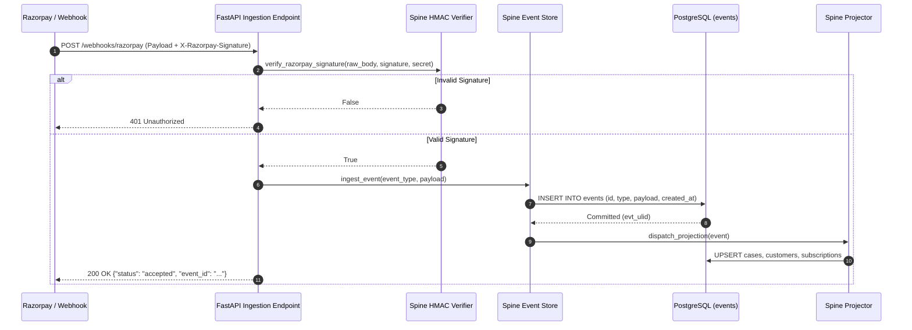

# SENTIO — System Architecture Document

## 1. Executive Summary

SENTIO is a policy-governed, autonomous revenue recovery and proactive churn prevention platform engineered for the **Razorpay AI Buildathon 2026** (Track 03 — AI Revenue Recovery). Operating as an intelligent, compliance-gated middleware between Razorpay (payment gateway) and subscription customers, SENTIO detects failed charges, diagnoses root causes via a hybrid deterministic-neural engine, schedules interventions around Indian payday cycles and RBI/NPCI retry constraints, and gates every single action behind 8 deterministic compliance rules with tamper-evident cryptographic receipts.

SENTIO bridges two complementary operational modes:
1. **Reactive Autonomous Recovery (Cure Engine)**: A 7-stage autonomous recovery loop ingesting real Razorpay webhooks, diagnosing failures (<5ms heuristic matrix or T1 OpenRouter fallback), evaluating Guard compliance, timing outreach within legal daylight hours (09:00–21:00 IST), generating empathetic Latin-script Hinglish WhatsApp messages (T2), extracting customer Promise-to-Pay dates (T3), and verifying gateway settlement.
2. **Proactive Churn Prevention (Precaution Engine / Pulse)**: Automated daily sweeps scanning active subscriptions prior to scheduled debit execution to detect 30-day expiring card instruments and mandate retry budget limits (≥ 2 attempts used), avoiding doomed transactions and saving merchants standard bank retry penalty fees (₹180/attempt).

All architecture is anchored on an **Event Sourcing** paradigm with Command Query Responsibility Segregation (CQRS). State transitions are completely rebuildable from an append-only event store (`events` table).

---

## 2. High-Level Architectural Topology

The system operates as a single-process FastAPI backend (Python 3.14) paired with an asynchronous PostgreSQL database and a responsive Next.js 16 (React 19 + Turbopack) dashboard.

```mermaid
flowchart TD
    subgraph Ingestion["External Ingestion & Stimulation"]
        RZP["Razorpay Gateway (Test Mode / Live Webhooks)"]
        MIR["Mirror Simulator (Seeded 200 Personas)"]
        STP["Live Neural Stepper (Multi-Scenario Testbed)"]
    end

    subgraph Core["SENTIO Single-Process Engine (FastAPI / Python 3.14)"]
        SP["Spine Subsystem\nHMAC-SHA256 Verify · Append Store · Event Bus"]
        CE["Case Engine & Machine\nState Transitions · Recovery Ladders · Projections"]
        LN["Lens Subsystem\nDeterministic Matrix (<5ms) · T1 Long-Tail Fallback"]
        CH["Chrono Subsystem\nPayday Calendars · Legal Daylight (09:00-21:00 IST) · PTP"]
        GD["Guard Policy Firewall\n8 Deterministic Rules · Cryptographic Receipts (rcpt_ulid)"]
        RE["Reach Executor (Side Effects)\nRazorpay Links · WhatsApp/Email Adapters · Content Linter"]
        PL["Pulse Precaution Engine\nProactive Churn Sweeps · Expiring Instruments · Mandate Caps"]
    end

    subgraph External["External Neural Gateway & Communications"]
        OR["OpenRouter API\nPrimary: openai/gpt-5.6-luna\nFallback: deepseek/deepseek-v4-flash"]
        WA["WhatsApp Business API / Simulated Carrier (Latin Hinglish)"]
    end

    subgraph Persistence["Persistence & Audit Store"]
        DB[("PostgreSQL 18 / Supabase PG16\nImmutable events table + Projected Read Models")]
    end

    subgraph Presentation["Presentation & Operator Surface"]
        UI["Next.js 16 Dashboard\nCommand Center · Transaction Flowchart · Precaution Engine · Admin"]
    end

    RZP -->|Signed Webhook (X-Razorpay-Signature)| SP
    MIR -->|Wire-Identical HMAC Payloads| SP
    STP -->|Authentic Neural Requests| SP

    SP -->|Append-Only Commit| DB
    SP -->|Project Events| CE

    CE --> LN
    CE --> CH
    CE --> GD

    LN <-->|T1 Opaque Diagnosis| OR
    CH <-->|T3 PTP Date Parsing| OR
    RE <-->|T2 Latin Hinglish Drafting| OR

    GD -->|ALLOW Receipt| RE
    GD -->|DENY Receipt + Violations| SP

    RE -->|Generate Payment Link| RZP
    RE -->|Deliver Outreach| WA

    PL -->|Proactive Sweep Proposals| GD
    PL -->|Record Prevention Events| SP

    DB -->|SWR Dynamic Polling (2s)| UI
```

---

## 3. Subsystems & Pipeline Mechanics

### 3.1 Spine: The Cryptographic & Event Sourcing Backbone
- **Directory**: `backend/app/spine/`
- **HMAC Verification (`verify.py`)**: Computes SHA-256 HMAC of raw inbound webhooks using `RZP_WEBHOOK_SECRET`. Payloads failing `X-Razorpay-Signature` validation are immediately rejected with HTTP 401.
- **Append-Only Store (`ingest.py`)**: Commits raw payloads as immutable records to the `events` table with ULID keys (`evt_{ulid}`) and UTC timestamps. `UPDATE` and `DELETE` queries are prohibited.
- **Idempotency & Deduplication**: Enforces strict unique constraints on gateway transaction identifiers (`event_id`, `payment_id`), preventing double-processing on network retries.
- **Asynchronous Projections (`projector.py`, `project_case.py`, `project_intv.py`, `project_misc.py`)**: Materializes read models (`cases`, `customers`, `subscriptions`, `interventions`, `promises`). Read models can be purged and rebuilt 100% offline from the event stream via `rebuild_projections.py`.



### 3.2 Lens: Hybrid Deterministic & Neural Diagnosis
- **Directory**: `backend/app/lens/`
- **Fast-Path Matrix (`matrix.py`)**: Evaluates gateway decline codes (`BAD_REQUEST_ERROR`, `INSUFFICIENT_FUNDS`, `PAYMENT_EXPIRED`, etc.) against a deterministic matrix. Resolves ~90% of failures in <5ms with 1.0 confidence.
- **Neural Touchpoint T1 Fallback (`diagnose.py`)**: Opaque, unknown, or degraded gateway codes (`ERR_UNKNOWN_DEGRADATION_0x4F`, `NODE_HANDSHAKE_DROPPED`) invoke OpenRouter (`openai/gpt-5.6-luna`) to extract root cause, rationale, and confidence score.
- **Confidence Floor**: Any classification with confidence `< 0.70` automatically aborts autonomous intervention and routes to a human operator.

### 3.3 Chrono: Temporal Intelligence & Daylight Windowing
- **Directory**: `backend/app/chrono/`
- **Quiet Hours Enforcement (`timing.py`)**: Strict RBI compliance window (21:00–09:00 IST). Proposals generated during quiet hours are intercepted by Guard and rescheduled by Chrono for the next daylight window (09:15 AM IST).
- **Payday Proximity Windowing**: Correlates failure dates with customer salary cycles (e.g., month-end 28th–5th), scheduling recovery links to coincide with liquid fund availability.
- **PTP Scheduling (`ptp.py`, `ptp_book.py`)**: Consumes customer natural language replies (*"Will pay on the 7th after salary"*), invokes Touchpoint T3 for ISO-8601 extraction (`2026-09-07`), books the promise in the `promises` table, and queues wake-up jobs.

### 3.4 Guard: Deterministic Policy Engine (Firewall)
- **Directory**: `backend/app/guard/`
- **Zero AI Dependency**: Guard contains zero imports of LLM modules or external side effects; it is a pure Python decision engine.
- **Evaluation Mechanics**:
  - *Short-Circuit Rules (Rules 1–2)*: Instant rejection on active master Kill Switch or customer opt-out (`STOP`).
  - *Accumulate Rules (Rules 3–8)*: Evaluates daylight hours, 7-day contact caps (max 3), 6-hour contact gaps, exact link amount match, retry budget ceiling (max 3), and confidence floor (≥ 0.70).
- **Cryptographic Receipts (`receipt.py`)**: Produces an immutable, cryptographically structured receipt (`rcpt_{ulid}`) for **both** ALLOW and DENY verdicts, recording every rule checked, pass/fail status, and timestamp. Receipts are committed to Spine as `policy.allowed` or `policy.denied`.

```mermaid
flowchart TD
    PROP["Intervention Proposal"] --> R1{"Rule 1: Kill Switch?"}
    R1 -->|Enabled| D1["DENY: Kill Switch Engaged"]
    R1 -->|Disabled| R2{"Rule 2: Opt-Out Recorded?"}
    R2 -->|Customer Opted Out| D2["DENY: Customer Opted Out"]
    R2 -->|Active Customer| ACC["Accumulator Engine (Rules 3-8)"]

    ACC --> R3["Rule 3: Quiet Hours (21:00-09:00 IST)"]
    ACC --> R4["Rule 4: 7-Day Contact Cap (Max 3)"]
    ACC --> R5["Rule 5: Min 6h Gap Between Contacts"]
    ACC --> R6["Rule 6: Exact Amount Locked (Paise)"]
    ACC --> R7["Rule 7: Retry Budget Ceiling (Max 3)"]
    ACC --> R8["Rule 8: Model Confidence >= 0.70"]

    R3 & R4 & R5 & R6 & R7 & R8 --> VERIFY{"Any Violations Found?"}

    VERIFY -->|Yes (Violations > 0)| DENY_RCPT["Generate DENY Receipt (rcpt_ulid)\nCommit policy.denied to Spine"]
    VERIFY -->|No (Violations == 0)| ALLOW_RCPT["Generate ALLOW Receipt (rcpt_ulid)\nCommit policy.allowed to Spine"]

    D1 & D2 --> DENY_RCPT

    ALLOW_RCPT --> EXEC["Pass to Reach Subsystem for Execution"]
    DENY_RCPT --> HALT["Halt Execution · Reschedule or Escalate"]
```

### 3.5 Reach: Safe Side-Effect Executor
- **Directory**: `backend/app/reach/`
- **Execution Invariant**: Reach strictly refuses execution without a valid `ALLOW` policy receipt. No import path from `app/cases/` directly to `app/reach/` exists without passing through `app/guard/`.
- **Payment Link Generation (`links.py`, `rzp.py`)**: Generates amount-locked Razorpay payment links via live API client with HMAC webhook return hooks.
- **Copy Generation T2 & Linter (`draft.py`)**: Generates empathetic, Latin-script Hinglish messages via OpenRouter. Rejects aggressive debt-collection terms (`penalty`, `defaulter`, `legal`) and enforces mandatory opt-out instructions (`"Reply STOP to unsubscribe"`).
- **Communication Channels (`channels.py`)**: Dispatches messages across simulated carriers or WhatsApp endpoints, recording `message.sent` into Spine.

### 3.6 Pulse: Proactive Precaution Engine
- **Directory**: `backend/app/pulse/`
- **Scheduled Sweeps (`sweep.py`, `admin_sweep.py`)**: Performs recurring scans across active subscriptions before bank execution dates.
- **Risk Vectors**:
  - Card instruments expiring within 30 days.
  - Mandate retry budgets nearing exhaustion (≥ 2 failures).
- **Precautionary Interventions**: Emits `prevention.outreach_drafted` and `case.prevented` events, triggering proactive payment method update links to secure revenue before debit attempts fail.

---

## 4. End-to-End Operational Workflows

### 4.1 The 7-Stage Autonomous Reactive Recovery Loop
When a recurring payment fails on the gateway:
1. **Webhook Ingestion**: Ingests Razorpay `payment.failed`, validates HMAC-SHA256 signature, commits `payment.failed` to Spine, opens case (`DETECTED`).
2. **Lens Root-Cause Diagnosis (T1)**: Evaluates decline code against heuristic matrix; calls OpenRouter T1 on miss with live neural reasoning. Emits `diagnosis.made`.
3. **Guard Policy Gating**: Intercepts proposal, runs 8 deterministic compliance checks, and generates cryptographic receipt (`rcpt_ulid`).
4. **Chrono Temporal Scheduling**: Evaluates current time in `Asia/Kolkata`. If outside 09:00–21:00 IST, reschedules to 09:15 AM IST next day.
5. **Reach Outreach Drafting (T2)**: Drafts contextual Latin-script Hinglish WhatsApp copy via OpenRouter, lints content, and creates Razorpay payment link. Emits `link.created` and `message.sent`.
6. **Pulse Customer Reply & PTP Parsing (T3)**: Ingests inbound customer WhatsApp reply, calls OpenRouter T3 to extract Promise-to-Pay date, pauses retry ladder, and books promise. Emits `ptp.booked`.
7. **Gateway Settlement Verification**: Ingests Razorpay `order.paid` / `payment.captured`, reconciles amount in integer paise, transitions case to `SETTLED`, and updates live ledger.

### 4.2 The 5-Stage Proactive Churn Prevention Flow
1. **Autonomous Sweep Ingestion**: Daily cron sweep runs against active subscriptions in PostgreSQL.
2. **Risk Vector Identification**: Queries subscriptions with cards expiring within 30 days or retry count ≥ 2.
3. **Guard Policy Evaluation**: Evaluates `update_card_link` proposal, generating signed `rcpt_ulid`.
4. **Proactive Mandate Update Dispatch**: Dispatches proactive WhatsApp notification with card update portal link scheduled for next legal window.
5. **Involuntary Churn Avoided**: Customer updates instrument before debit date; records `case.prevented` and logs ₹ avoided loss.

---

## 5. Architectural Safety Invariants & AST Verification

To guarantee bank-grade reliability and eliminate rogue AI actions, SENTIO enforces structural invariants verified programmatically via Abstract Syntax Tree (AST) analysis in `backend/tests/test_architecture.py`:

```
                  ┌────────────────────────────────────────┐
                  │          LLM Subsystem (app/llm)       │
                  │  - Pure prompt contracts               │
                  │  - OpenRouter primary + fallback       │
                  │  - ZERO imports of DB / Reach / Gate   │
                  └───────────────────┬────────────────────┘
                                      │ Returns Pydantic Data Only
                                      ▼
                  ┌────────────────────────────────────────┐
                  │         Lens / Chrono / Cases          │
                  │  - Computes proposals & diagnoses      │
                  └───────────────────┬────────────────────┘
                                      │ Proposes Action
                                      ▼
                  ┌────────────────────────────────────────┐
                  │      Guard Policy Engine (app/guard)   │
                  │  - 8 Deterministic Compliance Rules    │
                  │  - Cryptographic Policy Receipts       │
                  │  - ZERO LLM imports (Pure Python/DB)   │
                  └───────────────────┬────────────────────┘
                                      │ ALLOW Receipt Only
                                      ▼
                  ┌────────────────────────────────────────┐
                  │      Reach Executor (app/reach)        │
                  │  - Razorpay Test Client & Webhooks     │
                  │  - Dispatches WhatsApp / Email Links   │
                  │  - REFUSES execution without ALLOW     │
                  └────────────────────────────────────────┘
```

1. **LLM Module Isolation (`test_llm_module_has_no_gateway_or_reach_imports`)**: `app.llm` contains zero imports or references to `app.reach`, `app.api`, `app.guard`, or database mutation layers. The LLM physically cannot execute payment actions or dispatch messages.
2. **Policy Engine Purity (`test_guard_module_is_pure_and_has_no_llm_imports`)**: `app.guard` contains zero references to `app.llm` or `app.reach`. The compliance engine is 100% deterministic and immune to prompt injection.
3. **Audit Spine Immutability (`test_spine_module_never_imports_reach_or_llm`)**: `app.spine` only consumes and persists append-only events. Projections can be rebuilt 100% offline from the event stream.
4. **Financial Integer Standard**: All monetary values are strictly represented in integer paise. Floats are banned across the entire backend.
5. **Code Scale Invariant (Rule 2)**: All backend code files are strictly capped under 100 lines of code (LOC) to guarantee single-responsibility modularity.

---

## 6. Live Neural Stepper & Multi-Scenario Testbed

To enable real-time verification without synthetic mocking (Rule R9), SENTIO provides an interactive multi-scenario testbed in `backend/app/api/admin_stepper.py`:
- **Real OpenRouter HTTPS Inference**: Zero mocked strings or artificial sleep timers. Every step invokes live neural inference with authentic network latencies (~4–5s total).
- **4 Diverse Personas**:
  1. *Priya Patel* (₹1,499) — Node Handshake Timeout ➔ Tomorrow PTP
  2. *Amit Verma* (₹499) — Switch Latency Timeout ➔ 5th PTP
  3. *Sneha Reddy* (₹2,999) — Intermediary Auth Drop ➔ 7th PTP
  4. *Vikram Singh* (₹799) — Known Fast-Path Matrix ➔ 10th PTP
- **12 Dynamic Customer Reply Scenarios**: Simulates authentic Indian financial situations (Salary on 7th, Payday on 10th, Train travelling/network drop, Card blocked/reissue, UPI outage, FD liquidation, Client invoice, Spouse OTP, Month-end salary, Bonus, Billing dispute, Morning bank visit) plus custom write-in text and amounts.

---

## 7. Performance & Scientific Verification

| Metric Dimension | Target Bar | Benchmark (Seed 42, 200 Personas) | Verification Method |
|---|---|---|---|
| **Recovery Rate (Arm A - Sentio)** | ≥ 70.0% | **79.5%** (159 / 200 cases) | `run_two_arm_experiment.py` |
| **Baseline Recovery (Arm B - Naive)** | Industry standard | **18.0%** (36 / 200 cases) | Randomized holdout run |
| **Incremental Causal Lift** | ≥ 2.0x | **4.22x Lift** (+61.5% pts) | Two-arm comparison |
| **Policy Compliance** | 100% | **100%** (263 violations blocked) | Policy receipts audit |
| **Heuristic Matrix Latency** | < 10ms | **< 5ms** | Benchmarked in `test_lens.py` |
| **Contact Efficiency** | < 2.5 / case | **1.84 contacts / recovery** | Audit event ledger |
| **Automated Test Suite** | 100% Pass | **56 / 56 tests passed** (3.5s) | Pytest suite |
| **Frontend Production Build** | Zero Errors | **Turbopack compiled clean** | `npm run build` |
