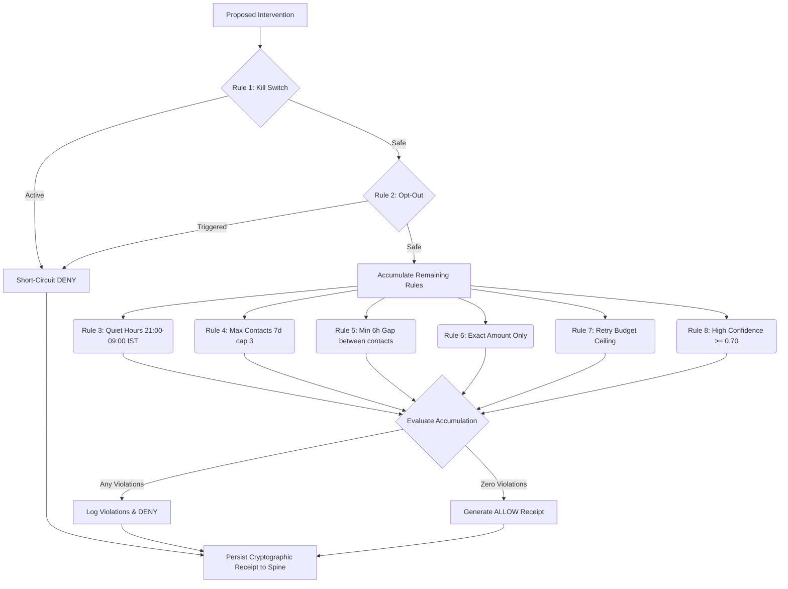

# SENTIO - Detailed System Design

## 1. Core Design Principles

The design of SENTIO is governed by a strict set of technical and philosophical mandates designed to maximize reliability, predictability, and auditability in a high-stakes financial context.

### 1.1 Deterministic First Strategy
Any decision that can be resolved via a deterministic rule, lookup table, bounded arithmetic, or boolean logic must be handled by deterministic code. Neural inference (LLMs) is strictly relegated to the "long tail" of unstructured data processing (e.g., parsing raw human text, categorizing undocumented error codes). The system must never rely on an LLM to calculate retry boundaries, assess legal compliance, or calculate financial totals.

### 1.2 Zero Hardcoding Mandate
All external integrations must function dynamically. Simulation engines, stepping tools, and local testing environments must utilize live API connections. Synthetic string mocking or hardcoded sleep timers are prohibited in production pathways. The system must process genuine data payloads and incur authentic network latencies to ensure accurate telemetry and realistic system behavior under load.

### 1.3 Click-Through Explainability
Every action taken by the system—whether dispatching a WhatsApp message, pausing for quiet hours, or closing a case—must be traceable back to its origin through the immutable event spine. An operator must be able to click through a final outcome to view the exact diagnostic confidence, the exact prompt fed to the LLM, and the exact cryptographic receipt generated by the compliance engine.

## 2. LLM Integration Design (The Neural Touchpoints)

The LLM subsystem acts strictly as an analytical tool, completely decoupled from any execution capabilities. All requests are routed through a unified OpenRouter HTTP client (`app/llm/client.py`), abstracting away specific provider SDKs.

### 2.1 Model Routing, Fallbacks, and Latency
- **Primary Inference:** `openai/gpt-5.6-luna` is utilized for primary inference due to its superior reasoning capabilities and strict adherence to JSON schema outputs.
- **Secondary Fallback:** `deepseek/deepseek-v4-flash` is configured as an automatic fallback.
- **Fallback Trigger Logic:** Fallbacks are triggered strictly on network transport errors (e.g., HTTP 502) or Pydantic schema validation failures from the primary model. Low confidence scores do *not* trigger a fallback; they trigger a deterministic human-handoff protocol.

### 2.2 Touchpoint Contracts

#### T1: Opaque Diagnosis
When the Lens matrix fails to map a decline code (e.g., `ERR_UNKNOWN_DEGRADATION_0x4F`), T1 is invoked.
- **Input:** Raw gateway error payload, transaction context, timestamp.
- **Output:** Categorized root cause, a one-sentence diagnostic rationale, and a float confidence score (0.0 to 1.0).

#### T2: Hinglish Drafting
Responsible for generating localized, culturally resonant outreach copy.
- **Input:** Customer name, amount at risk, root cause, and temporal context.
- **Constraint:** Output must be strictly Latin-script Hinglish to ensure optimal delivery and readability across the WhatsApp Business API. Devanagari script is actively rejected via a post-generation regex linting step.
- **Output:** A single string of conversational text.

#### T3: Promise-To-Pay (PTP) Extraction
Extracts structured temporal data from highly unstructured, conversational customer replies.
- **Input:** Raw conversational text (e.g., "Bhai salary 5th ko aayegi tab pakka pay kar dunga").
- **Output:** Extracted ISO-8601 date (`YYYY-MM-DD`), and a boolean indicating genuine intent to pay.

## 3. Guard Policy Design (The 8 Rules)

The Guard is a deterministic firewall. It evaluates all proposed interventions against 8 hardcoded rules. The logic employs a mix of short-circuit evaluation for critical stops and accumulation evaluation for detailed auditing.

## 4. Database & Event Sourcing Design

The PostgreSQL database is the single source of truth, heavily relying on its robust JSONB capabilities for event payloads.

### 4.1 The Event Spine
The `events` table stores every mutation. 
- Schema: `id` (ULID, primary key), `event_type` (String index), `payload` (JSONB), `ts` (Timestamptz).
- It is impossible to lose state history. If a bug is introduced in a projection, the `events` table can be replayed to rebuild the exact state of the universe.

### 4.2 Projections
Read models are constructed by the `projector.py` observing the event stream.
- **Cases:** Tracks the lifecycle (`DETECTED`, `INTERVENING`, `SETTLED`).
- **Interventions:** Tracks every specific action attempted, strictly linking it to its Guard Policy Receipt ID.

## 5. Next.js Dashboard Design

The presentation layer is an App Router-based Next.js 16 application, built with React 19, Tailwind CSS v4, and Shadcn/ui.

### 5.1 Architecture & State Synchronization
- **SWR Polling:** The dashboard relies on SWR for data fetching, utilizing aggressive short polling intervals (e.g., 2s for the event ticker) to simulate a real-time WebSocket experience without the associated infrastructure overhead.
- **Theme Engine:** A custom theme engine utilizes `useSyncExternalStore` synchronized with `localStorage` and Tailwind CSS variables. It supports distinct, professional palettes:
  - *Light Mode:* Warm cream backgrounds (`#fdf4d2`) with sky blue accents (`#b0cde6`).
  - *Dark Mode:* Deep teal backgrounds (`#0f3040`) with terracotta accents (`#a56f63`).

### 5.2 Precaution Flowchart Component
A dynamic 5-stage visualization detailing the Pulse engine's autonomous sweeps. It maps active PostgreSQL records to visual nodes showing:
1. Autonomous Cron Sweep parameters.
2. Target Risk Vector Identification (e.g., Retry Ceiling >= 2).
3. Guard Policy Gate evaluation.
4. Proactive WhatsApp Mandate Update Dispatch scheduling.
5. Final Outcome / Churn Prevented (highlighting protected revenue in Rupees).

## 6. Experimentation & Two-Arm Scientific Design

SENTIO includes a robust simulation environment designed to scientifically prove its efficacy against baseline, legacy approaches.

### 6.1 The World Builder (Mirror)
The simulation initializes a standardized pool of 200 customer personas (seeded with PRNG `42` for strict mathematical reproducibility). Each persona is assigned a predefined payment failure scenario mimicking real-world distributions (insufficient funds, network timeouts, intermediary auth drops).

### 6.2 The Two Arms
The experiment executes the identical batch of 200 failures across two distinct execution loops:
- **Arm A (Agent Arm - Sentio AI):** Cases are routed through the full SENTIO pipeline (Lens diagnosis, Guard gating, Chrono daylight awareness, T2 localized messaging, T3 PTP extraction).
- **Arm B (Baseline Arm - Naive Retries):** Cases are routed through a naive retry loop simulating default gateway behavior (immediate retries up to 3 attempts, completely oblivious to local quiet hours, payday proximity, or context).

### 6.3 Metric Calculation & Proof
Metrics are derived entirely by iterating over the immutable event projections. The system calculates Total Recovered Revenue, Contacts per Recovery, and Net Causal Lift. By comparing Arm A against Arm B on an identical dataset, SENTIO provides a mathematically rigorous proof of its incremental value, eliminating confounding variables. The baseline run demonstrated a **4.22x Revenue Lift**.
