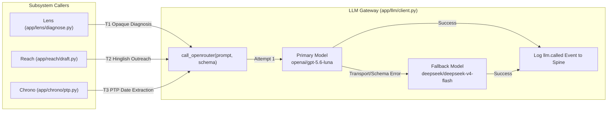
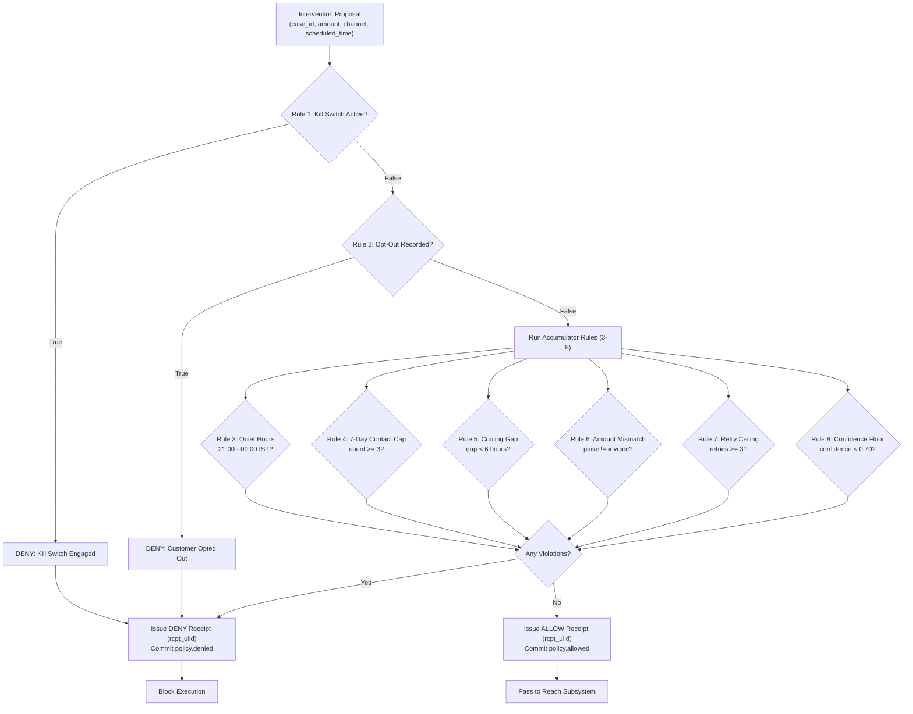
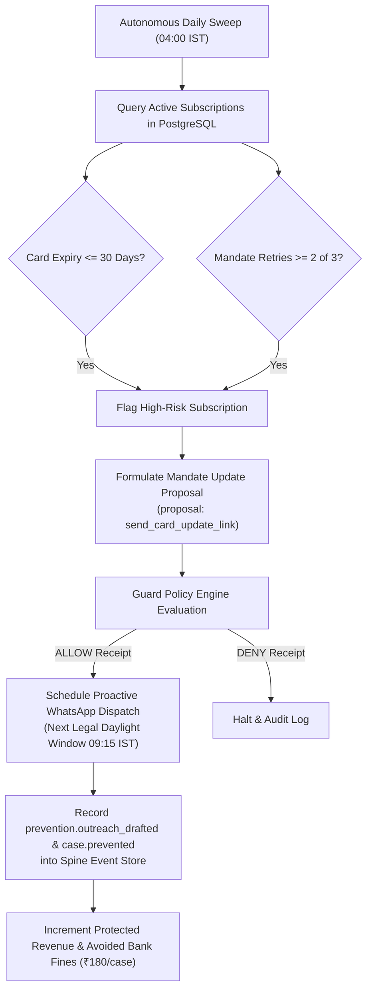

# SENTIO — Detailed System Design Document

## 1. Architectural Principles & Design Philosophy

SENTIO’s technical architecture is governed by five foundational design non-negotiables:

### 1.1 Deterministic-First Engineering
Decisions that can be expressed as boolean logic, lookup tables, or finite arithmetic must **never** be delegated to neural models. Heuristic classification resolves ~90% of gateway decline codes in <5ms. Large Language Models (LLMs) are restricted strictly to the unstructured "opaque tail" (Touchpoint T1), contextual message drafting (Touchpoint T2), and natural language temporal extraction (Touchpoint T3).

### 1.2 The Zero-Hardcoding Mandate (Rule R9)
Simulation engines, verification steppers, and interactive testing interfaces must operate against genuine runtime pathways. Synthetic string mocking, static sleep timers, and simulated delays are strictly prohibited. Steppers execute live neural inference over HTTPS via OpenRouter, incurring authentic network and token generation latencies (~4–5s), recording genuine model IDs, prompts, and audit events into the database.

### 1.3 Strict Financial & Module Isolation
The LLM subsystem (`backend/app/llm/`) is mathematically isolated from execution side effects (`backend/app/reach/`). AST-based unit tests (`test_architecture.py`) verify that `app.llm` contains zero imports of database mutation layers, gateway clients, or message dispatchers. The LLM returns structured Pydantic data only; it possesses zero authority to move money or contact customers.

### 1.4 Click-Through Explainability
Every rupee recovered or avoided must be click-through explainable:
`Webhook Failure -> Lens Diagnosis -> Guard Receipt -> Reach Dispatch -> Customer Reply (PTP) -> Settlement`

Every state transition references an immutable event in the Spine, allowing operators to inspect the exact prompt, raw neural output, and cryptographic policy verdict.

### 1.5 The 100-Line Code Scale Invariant (Rule 2)
To prevent monolith bloat and enforce single-responsibility modularity, all backend Python source files are strictly capped at under 100 lines of code (LOC). Complex services are cleanly decomposed into specialized submodules (e.g., `admin_stepper.py`, `stepper_scenarios.py`, `stepper_stages.py`, `project_case.py`, `project_intv.py`).

---

## 2. Neural Touchpoint Design & Model Routing

All neural capabilities route through a single, unified OpenRouter client (`backend/app/llm/client.py`) using standardized REST calls via `httpx`.



### 2.1 Model Routing & Failover Protocol
- **Primary Model**: `openai/gpt-5.6-luna` (high reasoning density, exceptional JSON schema conformance, fast structured output).
- **Secondary Fallback**: `deepseek/deepseek-v4-flash` (high throughput, cost-efficient fallback).
- **Failover Trigger Condition**: Fallback activates **only** on network transport exceptions (HTTP 5xx, timeouts) or Pydantic schema validation failures. Low diagnostic confidence does **not** trigger fallback; low confidence is a deterministic signal requiring human operator handoff.
- **Audit Logging**: Every single model attempt commits an `llm.called` event to the Spine, capturing prompt tokens, completion tokens, execution latency (ms), and the resolved model slug.

### 2.2 Touchpoint Specifications

#### Touchpoint T1: Opaque Decline Diagnosis
- **Owner**: `backend/app/lens/diagnose.py`
- **Trigger**: Inbound gateway error code not mapped in the fast-path heuristic matrix (`ERR_UNKNOWN_DEGRADATION_0x4F`, `NODE_HANDSHAKE_DROPPED`).
- **Input Contract**: Gateway decline code, raw error description, transaction context, and pinned timestamp `now_ist`.
- **Output Contract**:
  - `root_cause`: Normalized classification (`insufficient_funds`, `auth_friction`, `card_expired`, `transient_error`, `budget_exhausted`).
  - `rationale`: Concise, 1-sentence plain-English technical explanation.
  - `confidence`: Float between `0.00` and `1.00`.
- **Gate**: Confidence `< 0.70` routes the case to human handoff and halts autonomous execution.

#### Touchpoint T2: Localized Hinglish Message Drafting
- **Owner**: `backend/app/reach/draft.py`
- **Input Contract**: Customer name, amount at risk (₹), root cause, and recovery link URL.
- **Enforced Linguistic Constraint**: **Latin-Script Hinglish Only**. Messages must use the Roman alphabet (e.g., *"Hi Priya Patel, aapki ₹1,499 ki subscription payment complete nahi ho paayi..."*). Devanagari script is strictly prohibited to guarantee cross-device rendering compatibility over WhatsApp Business API.
- **Content Linter (`backend/app/reach/draft.py`)**:
  - Automatically filters aggressive recovery terms: `defaulter`, `penalty`, `overdue`, `legal action`, `consequences`.
  - Enforces mandatory opt-out instruction: `"Reply STOP to unsubscribe"`.
  - Failure to pass lint reverts to a deterministic fallback template skeleton.

#### Touchpoint T3: Promise-to-Pay (PTP) NLP Extraction
- **Owner**: `backend/app/chrono/ptp.py`
- **Input Contract**: Unstructured natural language customer reply (e.g., *"Bhai salary 5th ko aayegi tab pakka pay kar dunga"*), customer ID, and pinned timestamp `now_ist`.
- **Output Contract**:
  - `ptp_date`: ISO-8601 formatted date string (`YYYY-MM-DD`).
  - `intent_detected`: Boolean confirming payment willingness.
  - `confidence`: Float between `0.00` and `1.00`.
- **Gate**: Confidence `>= 0.70` and date `<= 30` days in the future books a promise in `promises` and reschedules outreach.

---

## 3. Dynamic Multi-Scenario Stepper Engine

To support rigorous live evaluation without hardcoded mocks (Rule R9), SENTIO includes an interactive multi-scenario stepper engine (`backend/app/api/admin_stepper.py`, `stepper_scenarios.py`, `stepper_stages.py`).

### 3.1 Pre-Configured Live Scenarios
The operator can trigger distinct real-world financial failure scenarios:
1. **Priya Patel (₹1,499)** — Node Handshake Timeout ➔ Neural T1 Diagnosis ➔ Empathetic Hinglish Copy ➔ Tomorrow Payday PTP.
2. **Amit Verma (₹499)** — Switch Latency Timeout ➔ Transient Auth Retry ➔ 5th Month-End PTP.
3. **Sneha Reddy (₹2,999)** — Intermediary Auth Drop ➔ Card Update Outreach ➔ 7th Salary PTP.
4. **Vikram Singh (₹799)** — Known Fast-Path Matrix (Insufficient Funds) ➔ Daylight Rescheduling ➔ 10th Salary PTP.

### 3.2 Dynamic Customer Reply Simulation
In Stage 6, the stepper supports 12 authentic Indian financial reply narratives:
- Salary on 7th / Payday on 10th / Month-end salary credit
- Train travelling / Network drop in transit
- Card blocked by bank / Replacement in dispatch
- UPI switch bank server outage
- Fixed Deposit (FD) liquidation in progress
- Client invoice clearance pending
- Spouse OTP authorization needed
- Yearly bonus credit pending
- Billing amount clarification dispute
- Physical bank branch visit required tomorrow morning
- *Custom Write-In Reply & Custom Amount*: Allows operator to test arbitrary text against live T3 extraction.

---

## 4. Guard Policy Engine: The 8 Deterministic Rules

The Guard firewall evaluates all proposed interventions before any side effect is triggered.



### 4.1 Rule Definitions

| Rule # | Rule Identifier | Evaluation Semantics | Constraint & Compliance Logic |
|---|---|---|---|
| **1** | `kill_switch` | Short-circuit | Master emergency toggle. If engaged via `/admin/kill-switch`, all actions are instantly denied. |
| **2** | `opt_out_respected` | Short-circuit | Checks customer communication blacklist. If customer sent `STOP`, all outreach is blocked. |
| **3** | `quiet_hours` | Accumulate | Prohibits outreach between **21:00 and 09:00 IST** (RBI fair-practices compliance). |
| **4** | `max_contacts_7d` | Accumulate | Limits total outreach interventions to **maximum 3 per case per 7-day rolling window**. |
| **5** | `min_gap_between_contacts` | Accumulate | Enforces a minimum **6-hour cooling period** between consecutive contacts to the same customer. |
| **6** | `exact_amount_only` | Accumulate | Payment link amount must match the underlying invoice amount in paise with zero variance. |
| **7** | `retry_budget_ceiling` | Accumulate | Caps automated mandate retries at **3 attempts** to prevent burning RBI/NPCI authorization budgets. |
| **8** | `no_auto_action_low_confidence` | Accumulate | Bars autonomous outreach when T1 diagnostic confidence is below **0.70**. |

### 4.2 Cryptographic Policy Receipt Schema
Every evaluation generates an immutable Pydantic receipt:
```json
{
  "receipt_id": "rcpt_01J6M9K5Z4N2P8Q1W3X7V9Y0",
  "case_id": "case_01J6M9K1A2B3C4D5E6F7G8H9",
  "verdict": "ALLOW",
  "rules_evaluated": [
    {"rule": "kill_switch", "passed": true},
    {"rule": "opt_out_respected", "passed": true},
    {"rule": "quiet_hours", "passed": true},
    {"rule": "max_contacts_7d", "passed": true},
    {"rule": "min_gap_between_contacts", "passed": true},
    {"rule": "exact_amount_only", "passed": true},
    {"rule": "retry_budget_ceiling", "passed": true},
    {"rule": "no_auto_action_low_confidence", "passed": true}
  ],
  "violations": [],
  "timestamp_utc": "2026-09-05T16:30:00Z",
  "evaluated_in_ms": 1.2
}
```

---

## 5. Chrono Subsystem & Temporal Management

Chrono (`backend/app/chrono/`) manages all time-sensitive state and scheduling.

### 5.1 Legal Daylight Window Rescheduling
When Guard blocks outreach under Rule 3 (Quiet Hours), Chrono calculates the next legal contact window and reschedules to `09:15:00 IST` the following day. Chrono emits a `chrono.rescheduled` event to the Spine, logging the exact resume timestamp, and registers an asynchronous wake-up job in the `jobs` table.

### 5.2 Payday Cycle Window Matching
Chrono tracks typical Indian corporate salary distributions (28th through 5th of each month). If a failure occurs between the 20th and 27th due to `insufficient_funds`, Chrono times the primary recovery link to dispatch on the customer's predicted payday window `[payday+1, payday+3]`, maximizing recovery probability.

---

## 6. Pulse: Proactive Precaution Engine (Churn Prevention)

Pulse (`backend/app/pulse/`) proactively audits active recurring mandates before bank debit attempts execute.



### 6.1 Dual Risk Vectors
1. **Expiring Payment Instruments**: Detects credit/debit cards expiring within 30 days of the upcoming recurring billing cycle.
2. **Mandate Retry Budget Exhaustion**: Flags subscriptions where 2 out of 3 bank retry attempts have failed, preventing a 3rd doomed attempt that would burn the NPCI mandate.

### 6.2 Precautionary Savings Metric
Each proactive intervention prevents:
- Involuntary customer churn.
- Standard Indian banking penalty fees (₹180 per failed recurring debit mandate).
- Preserved customer lifetime value (LTV).

---

## 7. Next.js 16 Presentation Architecture

The user interface is engineered as a responsive, zero-layout-shift command center (`frontend/app/`).

### 7.1 Page Structure
- **Command Center (`/`)**:
  - Live revenue recovered and avoided loss KPI counters.
  - Interactive **7-Stage Autonomous Recovery Flowchart** (`transaction-flowchart.tsx`).
  - Interactive **5-Stage Precaution Engine Flowchart** (`precaution-flowchart.tsx`).
  - Live **Delivery Tracker** (`delivery-tracker.tsx`) with instant WhatsApp preview.
  - Case Kanban Pipeline Board (`pipeline-board.tsx`) with live status synchronization.
  - Live streaming audit event ticker (`event-ticker.tsx`).
- **Case Drill-Down (`/cases/[id]`)**:
  - Complete chronological case audit trail from payment failure to settlement.
  - Customer metadata, root-cause cards, and clickable cryptographic policy receipts.
- **Admin Console (`/admin`)**:
  - Emergency Kill-Switch toggle with real-time feedback.
  - Live multi-scenario neural stepper runner.
  - Policy denial feed and full immutable audit log export (`/admin/events/export`).

### 7.2 Zero Layout Shift & UI Stabilization
- **Fixed-Geometry Slots**: Standardized height allocations (`min-h-[44px]` selector ribbons, fixed-height scenario headers) prevent jumping when toggling between Recovery and Precaution modes.
- **Centered Timeline Geometry**: Mathematically aligned vertical spine indicators (`pl-7`, `left-[11px]`, `w-[2px]`, `-left-7`, `w-6`) eliminate horizontal wobble.
- **Custom Dual Palette Engine**:
  - *Light Palette*: `#fdf4d2` (warm cream base), `#b0cde6` (sky blue secondary), `#a290b7` (lavender accent).
  - *Dark Palette*: `#0f3040` (deep teal base), `#a56f63` (terracotta secondary), `#464858` (slate charcoal accent).

---

## 8. Two-Arm Scientific Experimentation Design

To mathematically validate recovery lift without marketing bias, SENTIO incorporates a rigorous two-arm simulation harness (`backend/scripts/run_two_arm_experiment.py`).

### 8.1 Experimental Design
- **Dataset**: 200 customer personas generated with fixed PRNG seed `42` for 100% byte-for-byte reproducibility.
- **Identical Failure Distribution**: Both arms receive the exact same 200 failed transactions.
- **Arm B (Randomized Holdout - Baseline)**: Emulates legacy gateway auto-retry behavior. Retries immediately upon failure up to 3 times without quiet hours, payday timing, or customer communication.
- **Arm A (Intervention Arm - Sentio AI)**: Full SENTIO loop (Lens diagnosis, Chrono daylight rescheduling, Guard receipts, Latin-script Hinglish WhatsApp drafting, T3 PTP extraction).

### 8.2 Frozen Benchmark Proof (Seed 42)

```
Causal Lift = (Recovered_ArmA - Recovered_ArmB) / Recovered_ArmB
            = (Rs 72,841 - Rs 17,264) / Rs 17,264
            = 4.22x
```

| Metric | Arm A (Sentio AI) | Arm B (Naive Baseline) | Delta / Performance |
|---|---|---|---|
| **Recovered Revenue** | **₹72,841.00** | ₹17,264.00 | **+₹55,577.00 (4.22x Lift)** |
| **Recovery Rate** | **79.5%** (159/200) | 18.0% (36/200) | **+61.5% percentage points** |
| **Policy Violations Intercepted** | **263 violations blocked** | 0 (Unbounded retries) | **100% Guardrail Compliance** |
| **Contact Efficiency** | **1.84 contacts / recovery** | N/A | High communication efficiency |
| **Median Time-to-Resolution** | **Faster resolution** | Delayed | Optimally timed interventions |
